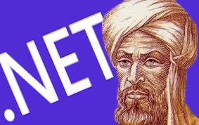

# AlKhawarizmi.NET

```
    _    _ _  ___                              _              _ _   _ _____ _____ 
   / \  | | |/ / |__   __ ___      ____ _ _ __(_)______ _ __ (_) \ | | ____|_   _|
  / _ \ | | ' /| '_ \ / _` \ \ /\ / / _` | '__| |_  / _` / __| |  \| |  _|   | |  
 / ___ \| | . \| | | | (_| |\ V  V / (_| | |  | |/ / (_| \__ \ | |\  | |___  | |  
/_/   \_\_|_|\_\_| |_|\__,_| \_/\_/ \__,_|_|  |_/___\__,_|___/_|_| \_|_____| |_|  
```

A powerful CLI tool for generating clean architecture .NET projects with best practices baked in. AlKhawarizmi.NET helps you bootstrap production-ready .NET applications with various architectural patterns and cross-cutting concerns configured out of the box.

## 🌟 Features

### Architecture Patterns
- Clean Architecture
- Domain-Driven Design (DDD)
- Command Query Responsibility Segregation (CQRS)

### Testing Framework Integration
- xUnit
- NUnit
- MSTest
- Test project templates with example test cases

### CI/CD Pipeline Generation
- GitHub Actions workflows
- Azure DevOps pipelines
- GitLab CI pipelines
- Docker configuration with multi-stage builds
- Kubernetes deployment manifests

### Cross-Cutting Concerns
- Structured logging with Serilog
- Distributed caching with Redis
- JWT-based authentication
- Global error handling with RFC 7807 support
- Health checks (coming soon)
- API versioning (coming soon)
- Rate limiting (coming soon)

## 🚀 Installation

```bash
dotnet tool install --global AlKhawarizmi.NET
```

## 🎮 Quick Start

### Create a new project

```bash
alkh new MyAwesomeProject --pattern clean --test xunit --ci github
```

This will create a new solution with:
- Clean Architecture structure
- xUnit test project
- GitHub Actions CI/CD pipeline
- Docker and Kubernetes configurations

### Add features to an existing project

```bash
alkh add MyAwesomeProject --features logging,caching,auth,errorhandling
```

This will add:
- Serilog logging configuration
- Redis caching integration
- JWT authentication
- Global error handling middleware

### Generate project from specification (Experimental)

```bash
alkh from-spec specification.pdf --name MyProject
```

## 🏗️ Project Structure

When using Clean Architecture pattern:

```
MyAwesomeProject/
├── src/
│   ├── Domain/
│   │   ├── Common/
│   │   │   ├── Entity.cs
│   │   │   └── ValueObject.cs
│   │   ├── Entities/
│   │   └── Interfaces/
│   ├── Application/
│   │   ├── Common/
│   │   ├── Interfaces/
│   │   └── Services/
│   ├── Infrastructure/
│   │   ├── Persistence/
│   │   ├── Authentication/
│   │   ├── Caching/
│   │   ├── Logging/
│   │   └── ErrorHandling/
│   └── Api/
│       ├── Controllers/
│       └── Middleware/
├── tests/
│   └── MyAwesomeProject.Tests/
├── docker/
│   ├── Dockerfile
│   └── docker-compose.yml
├── kubernetes/
│   └── deployment.yml
└── .github/workflows/
    └── build.yml
```

## ⚙️ Configuration

### appsettings.json

```json
{
  "ConnectionStrings": {
    "DefaultConnection": "Server=(localdb)\\mssqllocaldb;Database=MyAwesomeProject;Trusted_Connection=True"
  },
  "Jwt": {
    "Secret": "your-secret-key",
    "Issuer": "your-issuer",
    "Audience": "your-audience"
  },
  "Redis": {
    "ConnectionString": "localhost:6379"
  },
  "Serilog": {
    "MinimumLevel": "Information",
    "WriteTo": [
      { "Name": "Console" },
      { "Name": "File", "Args": { "path": "logs/log-.txt", "rollingInterval": "Day" } }
    ]
  }
}
```

## 📋 Requirements

- .NET 8.0 SDK or later
- Docker (optional, for containerization)
- Kubernetes (optional, for container orchestration)
- Redis (optional, for caching)

## 🤝 Contributing

Want to contribute? Great! Check out our [Developer Guide](docs/DeveloperGuide.md) to get started!

1. Fork the repository
2. Create your feature branch (`git checkout -b feature/amazing-feature`)
3. Commit your changes (`git commit -m 'Add some amazing feature'`)
4. Push to the branch (`git push origin feature/amazing-feature`)
5. Open a Pull Request

## 📝 License

This project is licensed under the MIT License - see the [LICENSE](LICENSE) file for details.

## 🙏 Acknowledgments

- Named after Muhammad ibn Musa al-Khwarizmi, the father of algebra and algorithms
- Inspired by best practices from the .NET community
- Built with ❤️ for developers who value clean code and architecture 
